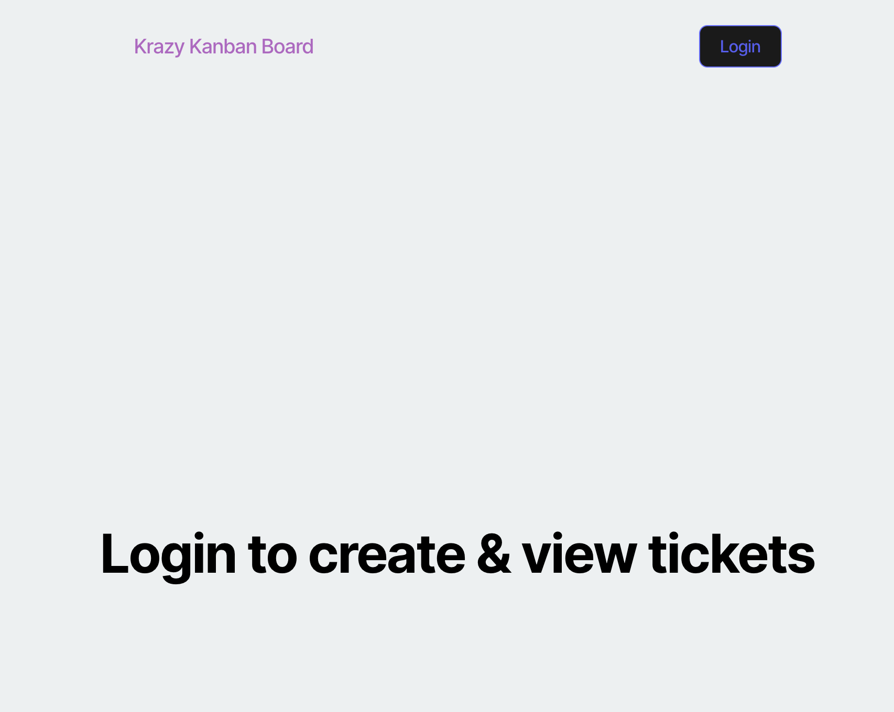
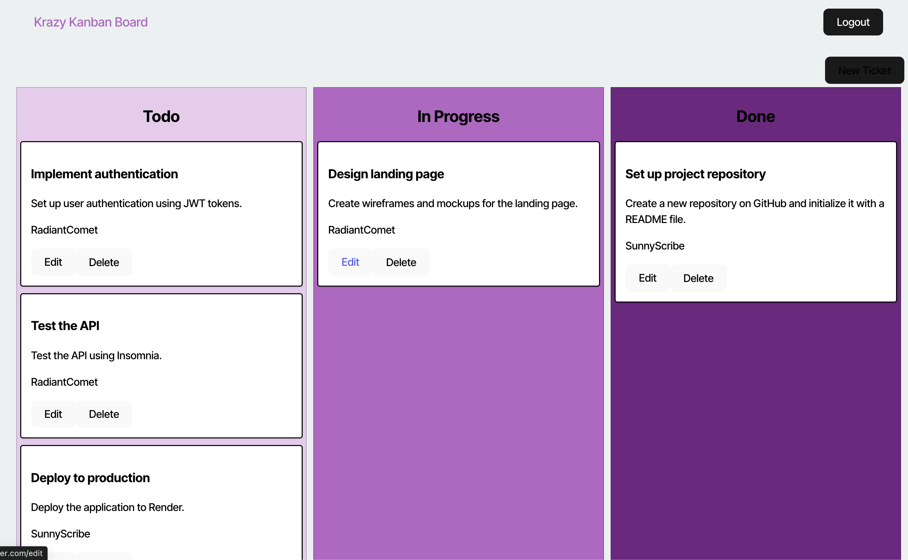

# Kanban_Board
Kanban board is a ticketing system to help track tasks. The purpose of this application is to create a secure Kanban board. 

## 📚 Description
This application is designed to create a secure Kanban Board that enables the user to track requests through compeletion.    

## 🚀 Table of Contents
  * [Usage](#📝-Usage)
  * [Features](#⭐-features)
  * [Credits](#🫱🏽‍🫲🏾-credits)
  * [License](#📃-license)
  * [Contact](#🗨️-contact)

## 📝 Usage
<strong>Using the Kanban Board</strong>

After logging in, a user will be able to create new tickets and process through created tickets. 

<u><strong>Login Page</strong></u>

<u><strong>Dashboard</strong></u>

Back to [Table-of-Contents](#🚀-table-of-contents)

## ⭐ Features
  * See potential candidates
  * Save potential candidates
  * View saved candidates
  * Edit saved candidate page

Back to [Table-of-Contents](#🚀-table-of-contents)

## 🫱🏽‍🫲🏾 Credits
***********PostgreSQL**********************

This applications requires the use of <strong>vite</strong>. Please find information regarding its use with the link below.

[Vite](https://vite.dev/guide/)

Back to [Table-of-Contents](#🚀-table-of-contents)

## 📃 License
This application is unlicensed. 

Back to [Table-of-Contents](#🚀-table-of-contents)

## 🗨️ Contact

  <strong>Email:</strong> [MelissaKikta2025@u.northwestern.edu](mailto:MelissaKikta@u.northwestern.edu)
  
  <strong>GitHub:</strong> [GitHub.com/MelissaKikta](https://github.com/melissakikta)

Back to [Table-of-Contents](#🚀-table-of-contents)

